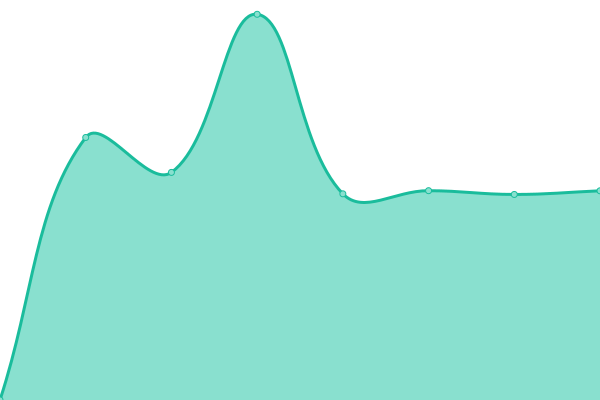

# [📈 Live Status](https://demo.upptime.js.org): <!--live status--> **🟩 All systems operational**

This repository contains the open-source uptime monitor and status page for [Ivan Larionov](https://blog.xeron.me), powered by [Upptime](https://github.com/upptime/upptime).

With [Upptime](https://upptime.js.org), you can get your own unlimited and free uptime monitor and status page, powered entirely by a GitHub repository. We use [Issues](https://github.com/xeron/status/issues) as incident reports, [Actions](https://github.com/xeron/status/actions) as uptime monitors, and [Pages](https://demo.upptime.js.org) for the status page.

<!--start: status pages-->
<!-- This summary is generated by Upptime (https://github.com/upptime/upptime) -->
<!-- Do not edit this manually, your changes will be overwritten -->
<!-- prettier-ignore -->
| URL | Status | History | Response Time | Uptime |
| --- | ------ | ------- | ------------- | ------ |
|  [Toyomec Repuestos](https://toyomecrepuestos.com) | 🟩 Up | [toyomec-repuestos.yml](https://github.com/xeronweb/status/commits/HEAD/history/toyomec-repuestos.yml) | 

 212ms
     
 | 

<a href="https://xeronweb.github.io/status/history/toyomec-repuestos">99.78%</a>
    

|  [Detailing Bahia](https://www.detailingbahia.com) | 🟩 Up | [detailing-bahia.yml](https://github.com/xeronweb/status/commits/HEAD/history/detailing-bahia.yml) | 

 2610ms
     
 | 

<a href="https://xeronweb.github.io/status/history/detailing-bahia">100.00%</a>
    

|  [Xeron Web](https://xeronweb.com) | 🟩 Up | [xeron-web.yml](https://github.com/xeronweb/status/commits/HEAD/history/xeron-web.yml) | 

 202ms
     
 | 

<a href="https://xeronweb.github.io/status/history/xeron-web">99.79%</a>
    

|  [Maria Guerrero](https://mariaguerrerodeco.com) | 🟩 Up | [maria-guerrero.yml](https://github.com/xeronweb/status/commits/HEAD/history/maria-guerrero.yml) | 

 317ms
     
 | 

<a href="https://xeronweb.github.io/status/history/maria-guerrero">100.00%</a>
    

|  [Upso](https://geccif.upso.edu.ar) | 🟩 Up | [upso.yml](https://github.com/xeronweb/status/commits/HEAD/history/upso.yml) | 

 757ms
     
 | 

<a href="https://xeronweb.github.io/status/history/upso">100.00%</a>
    

<!--end: status pages-->

[**Visit our status website →**](https://demo.upptime.js.org)

## 📄 License

- Powered by: [Upptime](https://github.com/upptime/upptime)
- Code: [MIT](./LICENSE) © [Ivan Larionov](https://blog.xeron.me)
- Data in the `./history` directory: [Open Database License](https://opendatacommons.org/licenses/odbl/1-0/)
